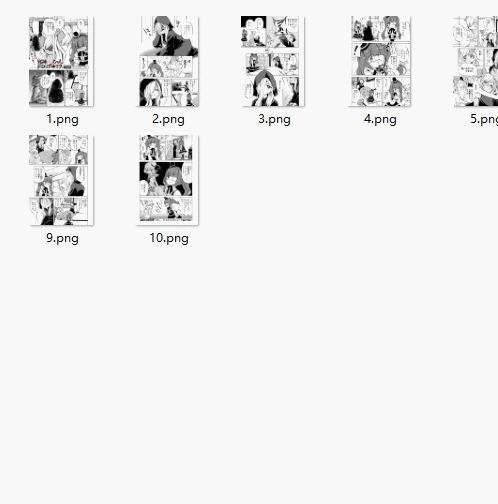
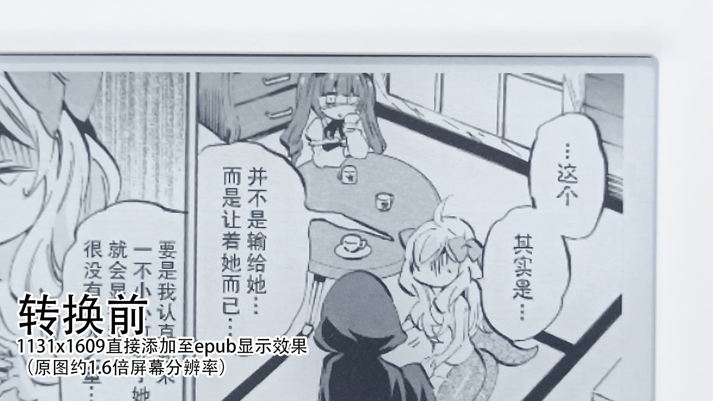
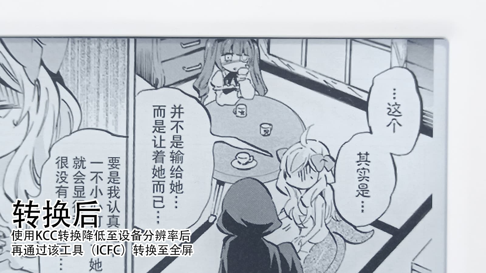

# iReader Comic FullScreen Converter
 用于将EPUB格式的漫画，转换为可以在iReader阅读器上完全全屏显示的格式。  
 除了转换图片以外，还支持简繁互转、“「互转、修复部分文件在iReader左下角章节空白、修复部分文件的换行排版
 
 下载地址：[https://github.com/wgzeyu/iReader-Comic-FullScreen-Converter/releases/latest](https://github.com/wgzeyu/iReader-Comic-FullScreen-Converter/releases/latest)  
 
 本项目采用易语言编写，引用了[精易模块](http://ec.125.la/)与[7-Zip](https://www.7-zip.org/)，均为开源项目。

### 使用方法

1. 前往KCC官网下载KCC并安装、运行：[https://kcc.iosphe.re/](https://kcc.iosphe.re/)
2. KCC调整以下设置：设备Other、格式EPUB、Gamma:Auto、Width:760、Height:1024（该分辨率为青春版设备）
3. 将保存有漫画图片的文件夹，整个文件夹拖入KCC
4. 点击Convert，开始将漫画转换为EPUB
5. 下载该软件（[ICFC](https://github.com/wgzeyu/iReader-Comic-FullScreen-Converter/releases/latest)），解压后运行
6. 将KCC转换出的EPUB文件**拖入**该软件（ICFC）
7. 点击开始转换，即可转换为可以在iReader中完全全屏显示的EPUB格式
8. 将转换完毕的EPUB格式导入iReader阅读器  

**注意：勾选文本转换选项时会自动勾选“不进行图片转换”，如果需要对图片进行全屏转换，请取消勾选“不进行图片转换”。**



### 效果对比



注意对比**上侧边框**部分以及**清晰度**：



### 原理
KCC导出的图片页面的html代码是这样的：
```html
<?xml version="1.0" encoding="UTF-8" ?>
<!DOCTYPE html>
<html xmlns="http://www.w3.org/1999/xhtml" xmlns:epub="http://www.idpf.org/2007/ops">
	<head>
		<title>img1</title>
		<link href="style.css" type="text/css" rel="stylesheet" />
		<meta name="viewport" content="width=760, height=1024" />
	</head>
	<body style="">
		<div style="text-align:center;top:0.0%;">
			
		</div>
	</body>
</html>
```
而该软件转换后，引用图片的方式会被修改为css引用背景图片：
```html
<?xml version="1.0" encoding="UTF-8" ?>
<!DOCTYPE html>
<html xmlns="http://www.w3.org/1999/xhtml" xmlns:epub="http://www.idpf.org/2007/ops">
	<head>
		<title>img1</title>
		<meta name="viewport" content="width=760, height=1024" />
		<style type="text/css">
			body{ 
				background-image:url('../Images/img1.png'); 
				background-repeat: no-repeat;
				background-size: contain; 
				background-position: center center; 
			}
		</style>
	</head>
	<body>
	</body>
</html>
```
